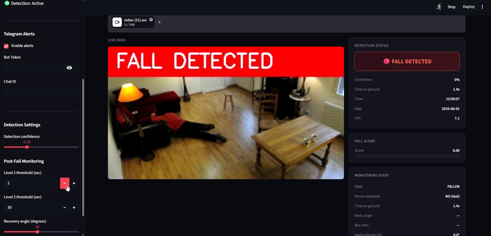
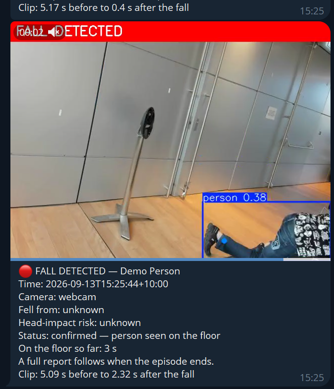
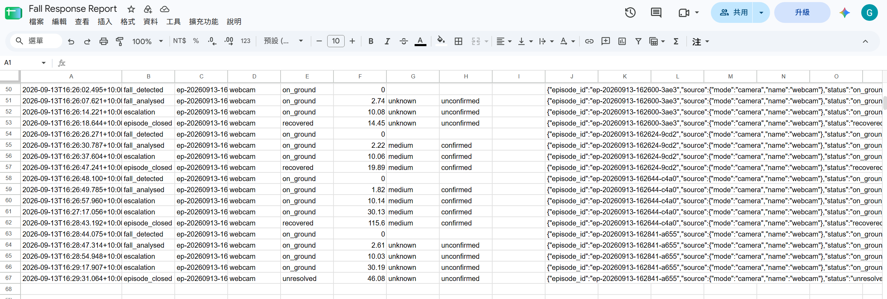
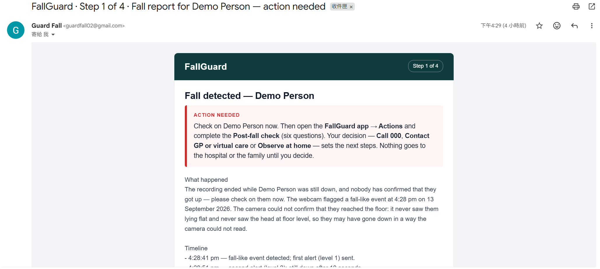
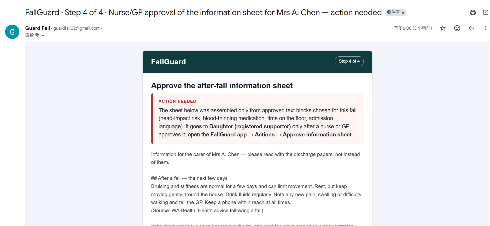
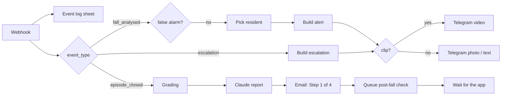

# FallGuard: from a detected fall to the right people, with a human in the loop

**🏆 Winner, n8n hackathon (September 2026).**



FallGuard watches a camera or a video file and answers the question a carer actually has: *did they get up?* When someone falls, the carer's phone receives a **short clip of the fall** within a few seconds. When the episode ends, an n8n workflow writes a plain-language report, asks the carer what they found and what they decided, and then produces the documents that follow a fall in Australian aged care: a transfer pack and ISBAR handover, a family notice, an incident-report draft, and a nurse-approved after-fall information sheet. Every decision is made by a person, inside the app, and recorded with who and when.

```
Camera / video ──▶ app (YOLOv8 detector + pose rules + episode tracker)
                      │  webhook events + 8 s H.264 clip
                      ▼
               n8n "FallGuard Flow 3"
                      ├─ fall_analysed / escalation ──▶ Telegram video alert to the carer
                      └─ episode_closed ──▶ Claude report (facts only) ──▶ email
                                            ──▶ decisions in the app: post-fall check → branch
                                                  Call 000 · GP / virtual care · observe at home
                                            ──▶ outcome → incident draft → approved information sheet → follow-up
```

## See it working

| Telegram: the fall clip arrives ~2.5 s after the fall | Google Sheet: every event appended to `event_log`, decisions to `pending_actions` |
|---|---|
|  |  |

| Email: Step 1 of 4 fall report (Claude, facts only) | Email: the approved after-fall information sheet |
|---|---|
|  |  |

The email layout can be previewed without running anything: open `docs/email_preview_fall_report.html` and `docs/email_preview_information_sheet.html` in a browser. A full information sheet as generated for a real episode is in `docs/sample_education_sheet.txt`.

## What is new in v2

| v1 (prototype) | v2 (this repo) |
|---|---|
| Telegram photo on every state change, sent by the app | App is the sensor only; n8n decides who is told, when, and how |
| Text alert | **Video clip of the fall** (5 s before, ~2.5 s after), photo and text as fallbacks |
| No report | Report written by Claude from measured values only: time, time on the floor, head-impact *risk*, fall height |
| No decisions | Post-fall check, family-notice approval, outcome and information-sheet approval, all inside the app with an audit trail |
| No documents | Transfer pack + ISBAR, family notice, incident-report draft, after-fall information sheet from approved blocks |
| Alerts for every trigger | `likely_false_alarm` episodes (crouches, bends) are logged and never alert anyone |

## How it works

### 1. Detection and the episode (app)

Three signals combined with OR: a YOLOv8s detector fine-tuned on Le2i, a rule score from YOLOv8n-pose keypoints, and a temporal rise in torso angle. A state machine tracks the episode (FALLEN → STILL DOWN → EMERGENCY → RECOVERED) and never treats "no person" as recovery. Around the fall, `FallAnalyser` estimates the pre-fall posture (fall-height category), the head-impact risk (how fast the head came down and whether it reached floor level) and a `fall_confidence` label.

The app posts one JSON event per state change to n8n: `fall_detected`, `fall_analysed` (with the clip), `escalation` (Level 2 / 3), `episode_closed` (recovered or unresolved). See `app/n8n/README.md` for the contract and `test_payloads/` for real examples.

### 2. Alerts and report (n8n)



### 3. Decisions in the app, documents by n8n

Each decision point queues a row in the `pending_actions` sheet and pauses. The app's **Actions** page lists the open rows; the carer answers there and the answer (plus name and time) resumes the execution. Emails only notify: what happened and what to do next.

| Step | Who decides | What follows |
|---|---|---|
| Post-fall check: ACD reviewed, injury, alertness, pain, mobility, **decision** | carer | Call 000 → transfer pack + ISBAR; GP → GP summary + reminder; observe → check-in reminders |
| Family-notice approval | carer | Fall notice to the registered supporter |
| Outcome: stayed home / ED then home / admitted | carer | Admission notice, incident-report draft, `incidents` sheet row |
| Information-sheet approval | nurse or GP | After-fall information sheet (approved blocks only) to the family, then a follow-up reminder |

## Run it

**Google Sheet**: create a spreadsheet and import the five CSVs in `sheets/` as tabs with those exact names. Fill `residents` (one row per camera or file name; a row named `default` covers unknown names).

**n8n Cloud**: create four credentials (Header Auth `X-FallGuard-Key`, Telegram API, Google Sheets OAuth2, Gmail OAuth2), import `n8n/FallGuard Flow 3.json` and `n8n/FallGuard pending actions.json`, point the Google Sheets nodes at your spreadsheet, and activate both workflows. The two Anthropic nodes run on n8n Gateway credits or your own key. `n8n/build_workflow.py` regenerates both files from the scripts in `n8n/code/`.

**App**:

```
git clone https://github.com/HollyHsu0808/fallguard.git
cd fallguard
pip install -r requirements.txt
# best.pt: download from the Releases page into models/ (yolov8n-pose.pt downloads itself)
cp .env.example app/.env        # then fill in the webhook URL and key
streamlit run app/app.py
```

Before a video runs, the Dashboard shows which resident row will be notified and warns if the Telegram chat ID or email is a placeholder. `python app/make_real_clip_payload.py "<video>"` builds a payload with a real fall clip for testing n8n without the app.

## Measured, and not

- Detector: fine-tuned from YOLOv8s on Le2i (320 px, 46 epochs); validation precision 0.82, recall 0.91, mAP50 0.88.
- Throughput: 5 to 9 processed frames per second on a CPU laptop, one source frame in three.
- Clip: 640 px H.264, about 8 s, 0.2 to 1 MB; delivered end to end (app → n8n → Telegram) in the hackathon tests.
- Not measured: end-to-end precision and recall of the three-signal trigger on held-out clips, and the accuracy of the head-impact risk rating. Both are the first roadmap items.

## Boundaries

- The report records what the camera measured. It never says an injury did or did not happen; head impact is a *risk rating*, fall height a *category*.
- No Medicare number, IHI or insurance number appears anywhere; the transfer pack lists the physical cards.
- The incident report is a draft; SIRS classification is a provider decision. The information sheet is assembled from approved text and is not sent without a nurse's or GP's approval.
- Telegram video alerts fit the home-care scenario with the resident's consent. A facility deployment would use its own channels and identity; see `docs/compliance_report_EN.md` for the regulatory review (Privacy Act and APPs, HRIP Act, Aged Care Quality Standards, SIRS, TGA software rules).

## Repo contents

```
fallguard/
├── app/                 app.py, fall_episode.py (episode tracker, fall analysis, clip encoder, n8n client),
│                        make_real_clip_payload.py, tests, n8n/README.md (event contract)
├── n8n/                 FallGuard Flow 3.json, FallGuard pending actions.json, build_workflow.py, code/
├── sheets/              CSV templates for residents, event_log, incidents, education_blocks, pending_actions
├── test_payloads/       one payload per event type, some with a real fall clip; curl_test.sh
├── docs/                compliance review, build guide and notes, design note, sample information sheet, figures
├── legacy/              v1 single-file app
├── models/              best.pt goes here (git-ignored)
├── CHANGELOG.md         v1 development history and the v2 changes
└── requirements.txt
```

## Attribution

Built by Yu-Yun Hsu, 2026. v1 was a university group project; v2 was built for the n8n hackathon. The product definition, state-machine design, fall analysis rules, Streamlit interface, model training, n8n workflow design and clinical-pathway research are the author's own work. Weights were fine-tuned from Ultralytics YOLOv8s. Screenshots show frames from the Le2i Fall Detection Dataset (Charfi et al., 2013), used for research and demonstration; the videos are not redistributed. Documentation and repository packaging were prepared with AI assistance.
