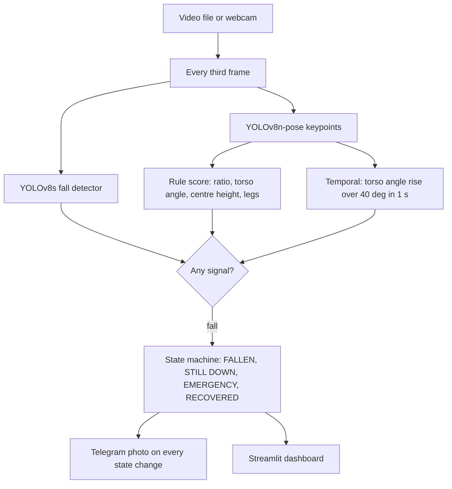
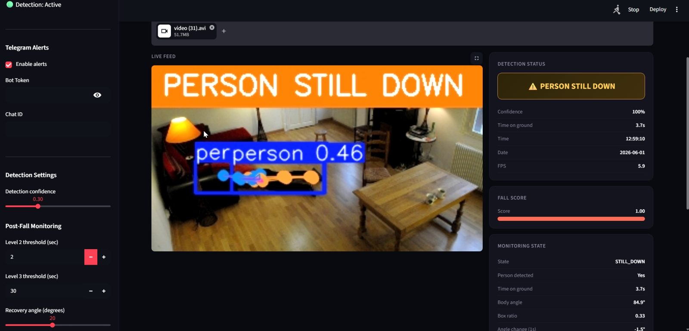
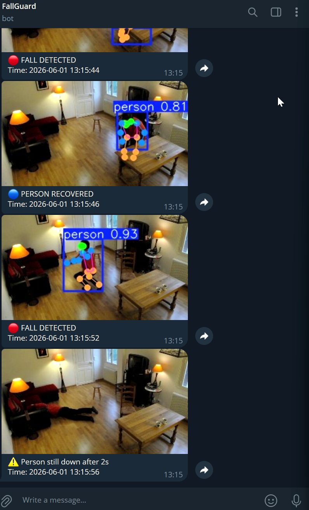

# FallGuard: Fall Detection with Escalating Alerts


A prototype that watches a video file or a laptop webcam, detects when an older person falls, keeps watching until they get up, and escalates to a carer over Telegram if they do not. On a CPU laptop it runs live at 5 to 7 processed frames per second.

## Why

Falls are a major safety issue for older people, and the harm grows with every minute spent on the floor unattended. A single-frame "fall or no fall" classifier answers the wrong question: what a carer needs to know is whether the person recovered. FallGuard is built around that second question.

## What it does

- Three detection signals combined with OR logic: a YOLOv8s detector fine-tuned on the Le2i fall dataset; a rule-based score from YOLOv8n-pose keypoints (box aspect ratio, torso angle, body-centre height, leg verticality; weights 0.3, 0.3, 0.2, 0.2; threshold 0.5); and a temporal signal that fires when the torso angle rises more than 40 degrees within about one second.
- A post-fall state machine: NORMAL, FALLEN (Level 1, immediate), STILL DOWN (Level 2, default 10 s), EMERGENCY (Level 3, default 30 s) and RECOVERED. Every state change, including recovery, sends a Telegram photo alert. Thresholds and the recovery angle are adjustable in the sidebar.
- A Streamlit dashboard with live feed, fall score, monitoring state, event history and settings.





## Product decisions

Each rule exists because a specific failure was observed during testing; the sequence is in CHANGELOG.md.

- Detector OR pose, not AND. The detector, trained only on Le2i, missed falls in unseen scenes while the COCO pose model still tracked body geometry.
- A temporal signal. Slowly sitting or lying down produced the same single-frame geometry as a fall; a 40-degree rise within a second separates the two.
- No person is not recovery. Early versions reported "recovered" when the pose model lost a fallen person. Recovery now needs a visible, upright person for four consecutive processed frames, and an active fall is never cleared by an empty frame.
- Scene reset only from a safe state. Test compilations cut between scenes; the reset that stops one clip's alert bleeding into the next fires only from NORMAL or RECOVERED.
- Escalation rather than one alarm. A fall the person recovers from arrives as a detected and recovered pair within seconds (docs/telegram-alerts.jpg); STILL DOWN and EMERGENCY arrive only when the person stays on the ground past the thresholds, so those two are the calls to action.



## Measured and not measured

- The detector was fine-tuned from Ultralytics yolov8s.pt on a two-class (fall, not-fall) dataset prepared from Le2i, at 320 px, batch 8, AdamW, for 46 of a planned 50 epochs with early stopping. best.pt is the best checkpoint of that run: validation precision 0.82, recall 0.91, mAP50 0.88, mAP50-95 0.44 (metrics stored inside the checkpoint by Ultralytics 8.4.56).
- Throughput on a CPU laptop is 5 to 7 processed frames per second with one source frame in three processed (FPS readouts in the screenshots).
- End-to-end precision, recall, false-alarm rate and alert latency of the three-signal trigger on held-out clips were not measured. That evaluation is the first roadmap item.

## Limitations and risks

- One person per frame: the first pose result is used.
- Camera angle and occlusion change the geometry the rules depend on; thresholds were tuned by hand on Le2i clips and web videos.
- Privacy: alert photos leave the device through Telegram. No consent flow, retention policy or on-device-only mode exists yet.
- Alerts are fire-and-forget; delivery is not confirmed, and events live only in session memory.

## Roadmap

1. A labelled evaluation set with a confusion matrix per signal.
2. Multi-person tracking.
3. Camera-angle robustness through more training data and angle-aware thresholds.
4. Live CCTV or RTSP input and cloud deployment.
5. Alert acknowledgement and delivery confirmation.

## Run locally

```
git clone https://github.com/HollyHsu0808/fallguard.git
cd fallguard
pip install -r requirements.txt
# download best.pt from the Releases page and put it in models/:
#   https://github.com/HollyHsu0808/fallguard/releases/download/v1.0/best.pt
# optional alerts: set FALLGUARD_TELEGRAM_TOKEN and FALLGUARD_TELEGRAM_CHAT_ID,
#   or copy .streamlit/secrets.toml.example to .streamlit/secrets.toml
streamlit run app.py
```

yolov8n-pose.pt downloads automatically on first run. Python 3.10 or later; tested on 3.13.

## Repo contents

```
fallguard/
├── app.py                 models, rules, state machine, alerts, UI
├── requirements.txt
├── CHANGELOG.md           what each of nine development versions changed, and why
├── .env.example
├── .streamlit/secrets.toml.example
├── models/                best.pt and yolov8n-pose.pt go here (git-ignored)
└── docs/                  dashboard states and Telegram alerts
```

## Attribution

Built by Yu-Yun Hsu, 2026, as a university group project; the product definition, state-machine design, Streamlit interface, model training and Telegram integration in this repository are the author's own work. Weights were fine-tuned from Ultralytics YOLOv8s. Screenshots show frames from the Le2i Fall Detection Dataset (Charfi et al., 2013), used for research and demonstration; the videos are not redistributed. The README, changelog and repository packaging were prepared with AI assistance.
