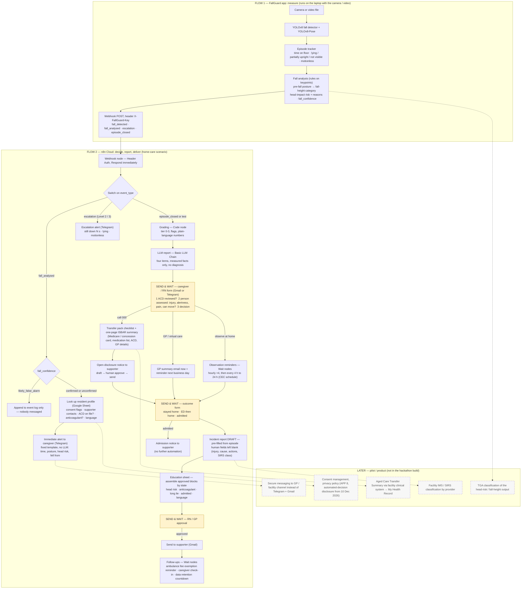

# FallGuard post-fall automation: Australian regulatory and clinical-communication review

Date: 13 September 2026 · Scope: Commonwealth and NSW law, residential and home-care settings, and the gap between the hackathon prototype and a pilot or product.

---

## 0. Summary

The overall design is lawful and workable. Four parts must change and one must be downgraded.

1. **Patient identifiers.** The report and its messages must not carry the Individual Healthcare Identifier (IHI) or the Medicare number. Unauthorised use or disclosure of an IHI is a criminal offence, and the law expressly forbids using an IHI for any insurance purpose. The Medicare number is a government identifier that ordinary organisations may not adopt or disclose. A hospital identifies a patient from name, date of birth, address and GP.
2. **The insurance and documents step.** In Australia, public-hospital emergency care is free for Medicare card holders and private-hospital claims are usually settled directly between the hospital and the insurer; patients do not "prepare reimbursement paperwork". What actually needs preparing is a *transfer pack* (medication list, advance care directive, GP details, Medicare and concession cards). The only place insurance details genuinely matter is the NSW ambulance bill: Medicare does not cover ambulance transport; concession-card holders and people with private cover are exempt, but the exemption has to be claimed with the card number.
3. **The decision to send to hospital, and notifying family.** In a residential facility the decision is not one carer's: a registered nurse assesses, checks the advance care directive (ACD) and any anticipatory orders, then follows the existing pathway (GP / virtual care, or 000). The flow must insert "ACD checked" before "confirm transfer". Family notifications must go to the person legally entitled to receive information (the new *registered supporter*, or a contact the resident nominated) and require the resident's prior consent.
4. **Education sheets.** Feasible, but only as an *assembly of approved official content selected by state*, never free-form LLM medical advice; a nurse or GP approves each sheet before it is sent. The reasons are the TGA's software-as-a-medical-device rules and professional liability.
5. **Downgrade: the incident report.** It can only be a *draft* for the provider's incident management system (IMS), never auto-submitted. Whether a fall is reportable under the Serious Incident Response Scheme (SIRS) is decided by the provider, and only for the eight reportable categories.

Two issues run through the whole flow: **consent** (the camera, the data leaving Australia to n8n Cloud and the LLM, and notifying family each need the resident's or their legal representative's consent) and **channels** (Telegram is not an acceptable channel for health information in a facility; it is fine for the demo and for a family-care scenario).

---

## 1. The regulatory map

| Instrument | What it governs | What it requires of this flow |
|---|---|---|
| Privacy Act 1988 (Cth) and the 13 Australian Privacy Principles (APPs) | Personal information; health information is *sensitive information* | Consent to collect health information (APP 3); use only for the collection purpose or a related purpose the person would expect (APP 6); security (APP 11); reasonable steps or consent before disclosing overseas (APP 8). The A$3 m small-business exemption **does not** apply to a business that provides a health service and holds health information (s 6D(4)(b)) — a fall-monitoring service will be treated as a health service. |
| Notifiable Data Breaches scheme | Data breaches | A breach likely to cause serious harm must be notified to the OAIC and the affected people; health information almost always meets the threshold. |
| Privacy and Other Legislation Amendment Act 2024 | From 10 June 2025: a statutory tort lets individuals sue for serious invasions of privacy (no small-business shelter). From 10 December 2026: privacy policies must disclose decisions made, or substantially assisted, by a computer program that significantly affect a person. | Our grading → "who is notified, is hospital recommended" is exactly such a decision: it must be disclosed, and a human should stay in the loop (the carer confirms). |
| Health Records and Information Privacy Act 2002 (NSW), 15 Health Privacy Principles | Any NSW organisation, public or private, that holds health information | Similar to the APPs, plus: keep information no longer than necessary and dispose of it securely; use limited to the collection purpose or a directly related purpose. |
| Healthcare Identifiers Act 2010 (Cth) | Collection, use and disclosure of the IHI | Unauthorised use or disclosure: up to 2 years' imprisonment or 120 penalty units (s 26(5)); expressly prohibited for underwriting, deciding cover, or determining whether cover applies to an event. **The IHI never enters the report, the messages, or any insurance step.** |
| Aged Care Act 2024, Aged Care Rules 2025, strengthened Aged Care Quality Standards (in force 1 November 2025) | All registered providers (residential and Support at Home) | Outcome 2.3 open disclosure — be open with the older person, their supporters and the family they choose when things go wrong. Outcome 2.5 incident management (including near misses). Outcome 2.7 information management. Outcome 3.3 communicating for safety. Outcomes 3.4 / 7.2 transitions to and from hospital. Standard 5 clinical care (falls). The new **registered supporter** can request, receive and communicate information on the person's behalf — the legally sensible recipient of "family" notifications. |
| Serious Incident Response Scheme (SIRS) and the Incident Management System (IMS) | Incident reporting | Every fall is an *incident* and must be recorded in the provider's IMS; it is a *reportable incident* only if it fits one of eight categories (unexpected death, neglect, …). Priority 1 within 24 hours, Priority 2 within 30 days. |
| National Aged Care Mandatory Quality Indicator Program | Residential quality indicators | Quarterly reporting of residents who had one or more falls, and falls with major injury (fractures, dislocations, closed head injury with altered consciousness, subdural haematoma, …). |
| Surveillance Devices Act 2007 (NSW), Workplace Surveillance Act 2005 (NSW) | Optical surveillance | A camera in one's own home is lawful. In a facility room, resident and provider are both treated as occupiers, so in practice both consent; staff will be recorded, so the employer must give prior written notice (14 days). South Australia's facility-CCTV pilot likewise ran on resident or family consent and clear signage. |
| Therapeutic Goods Act 1989 and TGA software-as-a-medical-device guidance | Software intended for the diagnosis, monitoring, prediction, prognosis or treatment of disease, injury or disability is a medical device | Consumer software giving only reminders and general health information is excluded; clinical decision support used by health professionals, not replacing their judgement and independently verifiable, can be exempt from ARTG listing. **Our output goes to carers and family and states a judgement ("head-impact risk high — seek medical assessment"), so a regulatory assessment is needed before commercialisation** (see §6). |

Where the data goes: n8n Cloud stores data in Frankfurt, Germany; LLM APIs are mostly in the United States. Both are overseas disclosures under APP 8 and must be stated in the consent form and privacy policy; check the provider's terms (major providers' APIs do not train on API data by default — confirm on the teammate's actual account terms).

---

## 2. Your flow, step by step

### Flow 1 — the app produces the report
Lawful. The report (time of event, time on the floor, head-impact risk, fall-height category) is a record of event facts and is health information, so the consent and security requirements above apply. **Wording decides the regulatory risk**: "the camera analysis rates the risk that the head struck the floor as high (basis: the head reached floor level at X)" is a factual record; "the patient has a head injury and needs a CT" is a diagnosis. The first is acceptable, the second is not.

### Flow 2a — the carer receives the report and confirms whether to send to hospital

**Current practice (residential):** the NSW *Deteriorating Resident Triage* tool runs: RN performs an A–G assessment → reviews the advance care directive and anticipatory orders → if hospital-level treatment is appropriate: call the ambulance, prepare an ISBAR handover, notify the ED; if facility-level care is appropriate: ISBAR handover to the GP by video, or the Healthdirect residential-care fast-track service → contact family → if the GP was not involved, notify the GP the next working day. Districts also run hospital outreach services (for example the Mid North Coast ACOS) specifically to avoid unnecessary ED transfers.

**Where we fit:** we cannot replace the RN assessment and must not let a carer "decide" transfer in an app. The correct position is that **our report is input to the RN assessment and the ISBAR handover**. The flow becomes:
1. report to the RN or carer on duty (facility) or the family carer (home);
2. node: "ACD and anticipatory orders checked" — if the resident has a "not for hospital transfer" or "comfort care only" instruction, the transfer branch shows it and requires explicit human confirmation;
3. node: "assessment result" entered by the person (injury, alertness, pain, able to move);
4. branches: observe in place (CEC guidance: vital signs and neurological observations at least hourly for the first 4 hours, then every 4 hours for 24 hours; stricter if unwitnessed, head strike, or on anticoagulants / antiplatelets) / GP or virtual care / call 000.

**Home scenario (your demo):** no facility pathway; the family carer receives the report; branches are 000 / healthdirect 1800 022 222 (24-hour nurse line) / GP.

### Flow 2b — patient details inside the report

Acceptable: name, date of birth, address or facility and room, GP name and phone, emergency contact (registered supporter), whether an ACD exists and where it is, known allergies, whether the person takes anticoagulant or antiplatelet medication (very useful to the ED, but health information that needs consent).

Not acceptable: the IHI; the Medicare number; private-insurance membership number; hospital medical-record numbers (hospital-specific, and unknown to us). These live in the transfer pack (physical cards) or the facility system; the ED clerk asks the patient or family directly.

### Flow 2c — confirm insurance and prepare a document list

This step comes from Taiwanese hospital habits and must be rewritten for Australia:

- Public-hospital ED: free for Medicare card holders; no paperwork is a precondition of treatment.
- Private hospital, or private patient in a public hospital: the hospital usually claims electronically from the fund; the patient pays an excess or gap. What is needed is the fund's name and membership card, not "reimbursement documents".
- **Ambulance:** not covered by Medicare. NSW residents pay about 51 % of the fee (the state subsidises 49 %), capped at A$7,601 (from July 2025); holders of a Health Care Card, Pensioner Concession Card, Commonwealth Seniors Health Card or DVA card are exempt; people with private cover have the fee paid by the fund. The exemption is claimed after the invoice arrives by supplying the card number; missing the due date adds a A$65 recovery fee. **This is the only point in the flow where insurance information genuinely matters**: an after-the-event reminder — "claim the exemption with card X".
- Overseas visitors and temporary-visa holders are not Medicare-eligible; the ED charges, and OVHC/OSHC insurance handles it. They are the exception group.

So the "insurance documents" step becomes two things: a transfer-pack checklist at the time of the fall (Appendix A) and an ambulance-exemption reminder afterwards.

### Flow 2d — the report helps diagnosis on arrival

**The evidence supports the value proposition, stated precisely:**

- NSW CEC and Queensland Health post-fall pathways put *unwitnessed fall* and *known or suspected head strike* in the same tier: assume possible head injury, start neurological observations, consider CT for anticoagulated patients; the Queensland residential-care pathway says "suspected head injury or unwitnessed fall → observe, call 000 or contact the GP as required", and requires reviewing the ACD.
- ECRI's post-fall checklist splits management into two tracks: "unwitnessed, or hit head, or on anticoagulants / antiplatelets" → neurological observations every 30–60 minutes; "witnessed and did not hit head" → vital signs only. **Whether the fall was witnessed directly changes the observation tier.**
- Monash Health study: 934 inpatient falls, 191 brain CTs, intracranial haemorrhage incidence 0.9 %; associated factors were head strike, anticoagulation, loss of consciousness or amnesia, a drop in GCS, and advanced kidney disease; the authors call for guidance that can reduce unnecessary scans.
- Queensland two-hospital audit: 874 falls in patients over 65, 90.6 % met pathway criteria for CT but only 50.1 % were scanned; serious head injury 2.25 %; trends for unwitnessed falls, head strike and anticoagulant use.
- CEC also notes that older people who fall carry a higher intracranial-injury risk even without a head strike.

**What we may say:** we turn an "unwitnessed fall" into a "documented mechanism" — pre-fall posture (standing height / seated / bed height / over 1 m), whether the head reached floor level and how fast, total time on the floor, time motionless, whether the person got up unaided. These are the inputs the pathways use to set the observation tier and decide on imaging. A long lie additionally prompts the ED to assess rhabdomyolysis (muscle breakdown from prolonged pressure, whose products damage the kidneys), dehydration and pressure injury.

**What we may not say:** "fewer unnecessary tests" is a possible outcome, not a promise; in an anticoagulated older person a CT is often done whether or not the head struck; a head-risk of "unknown" must never be read as "no head strike". The clinician decides.

**Delivery channel:** the formal channel from a NSW residential facility to the ED is the *Aged Care Transfer Summary* in My Health Record (transfer reason, medication chart, health summary), uploaded by the facility's clinical information system; on paper, the ISBAR handover. Our report should feed the facility's "reason for transfer" and the Background / Assessment parts of ISBAR, or be printed as a one-page attachment to the transfer pack — not a parallel channel straight to the hospital.

### Flow 2e — automatic family notification on admission

No hospital API tells us a patient was admitted. The trigger can only be a person: the carer or the accompanying relative chooses "admitted / went home / kept for observation" in the confirmation flow. The recipient must be the registered supporter or someone the resident nominated; the new Act lets a supporter receive and pass on information but not decide on the person's behalf unless separately authorised under state law. Whether to visit or stay is the family's own business — one message, no further automation.

### Flow 2f — the post-discharge incident report

The provider's IMS is the legal system of record; SIRS notifications and QI Program quarterly returns are produced from it. What we can do is **pre-fill a draft**: event time, time on the floor and its breakdown, head-impact risk with its basis, pre-fall posture, alert history, notification history (who was notified when), outcome (observed / ED / admitted / home). The fields a person must complete are in Appendix B. SIRS must never be auto-submitted; an ordinary fall is not a reportable incident — only the eight categories are — and the provider's responsible person classifies it and records the reasoning.

### Flow 2g — follow-up and education sheets

Existing material: WA Health publishes *Health advice following a fall — discharge advice for carers of adults who have had a fall* (with date/time-of-fall fields, warning signs, the healthdirect number); the NSW Emergency Care Institute has mild-head-injury sheets in community languages; the NSW closed-head-injury guideline requires discharge instructions covering 24-hour observation and return-to-hospital signs. Your observation that hospitals hand out generic advice is correct.

Feasible customisation is *conditional assembly*:
- head-impact risk high / medium → attach the mild-head-injury observation sheet (someone present for 24–72 hours, return signs);
- anticoagulant use (if known) → strengthen the "seek care immediately" section;
- time on floor over threshold or unable to get up → attach "what to do if you cannot get up" and personal-alarm information;
- admitted → attach post-discharge falls prevention (NSW Health resources);
- language switched to the family's setting.

Every block comes from an official source; the LLM only selects blocks and writes the joining sentences, never medical advice; an RN or GP approves with one click before sending. Regulatorily this sits closer to "digitisation of published clinical guidance" than to "personalised medical-advice software".

---

## 3. Does this conflict with how facilities already communicate?

| Existing practice | Our correct position |
|---|---|
| RN assessment and escalation (GP / virtual care / 000) | Supply facts, not decisions; add ACD check and assessment input |
| ISBAR verbal and written handover | Report = material for B and A; produce a one-page ISBAR summary |
| Aged Care Transfer Summary (My Health Record) | Do not build a second channel; our content feeds "reason for transfer" |
| Family notification by the RN (open disclosure) | Automate the draft and the reminder; a person confirms before sending; recipient = registered supporter |
| GP notified next working day | Add a delayed node: GP summary the next business day (with facility authority) |
| IMS record and QI quarterly returns | Pre-filled draft; statistics aligned to the QI definitions (fall, major injury) |

There is one real conflict: **the channel**. Facilities will not accept resident health information over Telegram; email is acceptable with restricted content (no frame snapshots, no identifiers). Telegram is fine for the hackathon demo; say in the presentation that the production version connects to the facility system or secure messaging.

---

## 4. What is missing and what is unnecessary

**Missing — add:**
1. Consent and preference node: camera, data flows (n8n in Germany, LLM in the US), who is notified and in what order, hours when notification is allowed — stored per resident and read at the start of the flow.
2. ACD / anticipatory-orders check before the transfer branch.
3. False-alarm handling: `fall_confidence = likely_false_alarm` → log only, no notification.
4. 24-hour observation reminders for staff (CEC schedule); revert to the usual frequency after 72 hours.
5. GP notification (next working day).
6. Retention and deletion rules (HRIP: no longer than necessary; frame snapshots especially short-lived) and a breach-notification procedure.
7. Unexpected-death branch: SIRS Priority 1 (24 hours), police and coroner — reminders only, never auto-sent.
8. Ambulance-fee exemption reminder (after the event, naming the card type).

**Unnecessary — remove or shrink:**
1. Insurance reimbursement workflow → transfer pack plus ambulance exemption.
2. Any automation after the family's "visit or not" choice.
3. Calling the LLM at Level 1 — immediate alerts use fixed templates; the LLM only writes the `episode_closed` report.
4. Sending fall snapshots to family — privacy and dignity; snapshots stay with the facility for assessment and are retained briefly.
5. Auto-submitting SIRS or any external report.

---

## 5. The feasible flow, v1 (hackathon build)

Solid nodes are built now with n8n Cloud, Gmail, Telegram and a Google Sheet; the amber nodes pause the workflow until a person answers (n8n's *Send and Wait* operation on Gmail / Telegram, or a Wait node resuming on a form); dashed nodes are for a pilot or product. The same diagram is in `fallguard_flow_v1.mermaid` and `fallguard_flow_v1.html`.

### Node list with the requirement each one satisfies

| # | Node | Built with (now) | Requirement or evidence it answers |
|---|---|---|---|
| B1 | Webhook with Header Auth | n8n Webhook node | Public n8n Cloud URL; APP 11 security |
| B3–B4 | False-alarm gate | IF on `fall_confidence` | Avoids alarming the family on crouches / bends (three of the seven test clips) |
| B5 | Resident profile lookup | Google Sheet | Consent flags and the legally entitled recipient (registered supporter); ACD existence; anticoagulant flag with consent |
| B6 | Immediate alert (template) | Telegram | Speed; no LLM at Level 1 |
| B7 | Escalation alert | Telegram | State-machine Levels 2/3; long-lie logic |
| B8 | Grading | Code node | Placeholder tiers until the team's criteria arrive; auto-decision disclosure obligation from Dec 2026 |
| B9 | Report | Basic LLM Chain | Four required items; facts only (TGA wording risk) |
| B10 | Caregiver / RN form | Gmail or Telegram *Send and Wait* (custom form) | ACD reviewed before transfer (Deteriorating Resident Triage tool); human decision stays with the person |
| C1 | Transfer pack + ISBAR | Gmail | Existing handover practice; replaces the insurance-documents step |
| C2 | Open-disclosure notice | Gmail *Send and Wait for Approval* → send | Outcome 2.3 open disclosure; recipient = registered supporter |
| C3 | GP summary | Gmail + Wait | "Notify GP next working day" |
| C4 | Observation reminders | Wait nodes + Telegram | CEC post-fall observation schedule |
| D1 | Outcome form | *Send and Wait* | Only a person knows whether the patient was admitted |
| D2 | Admission notice | Gmail | Family informed; no further automation |
| D3 | Incident report draft | Google Docs template | Outcome 2.5 / IMS; SIRS classification left to the provider |
| D4–D6 | Education sheet + approval | Google Docs blocks, LLM joins, *Send and Wait* approval | Conditional assembly of official content; clinician approval keeps it out of "personalised medical advice" |
| D7 | Follow-ups | Wait nodes | NSW ambulance exemption; HRIP retention limits |

---

## 6. Hackathon prototype versus pilot / product

| Item | Hackathon demo | Before a pilot or product |
|---|---|---|
| Consent | Actors and demo data — not needed | Written consent (resident or legal representative), privacy policy, overseas-disclosure statement |
| Channels | Telegram + Gmail | Facility clinical system or secure messaging; email content minimised |
| Identifiers | No IHI / Medicare number (apply now) | Same, written into the data standard |
| TGA | Not applicable | A regulatory adviser decides whether it is a medical device: a "risk rating + seek-care advice" delivered to non-professionals is likely to meet the definition; positioning as "event-fact record + generic safety message" lowers the risk. A disclaimer does not change the classification — the claimed purpose does. |
| Automated-decision disclosure | Not applicable | From 10 December 2026 the privacy policy must disclose the grading and notification decisions |
| Retention and breaches | Not applicable | Retention periods, deletion, NDB procedure |
| Education sheets | Assembled output can be shown | The RN / GP approval step must be real, not skipped |

---

## 7. Decisions for the team, and who to ask

1. Pick one scenario for the hackathon: **home (family carer)** or **residential facility**. Recipients, channels and legal duties differ; home is recommended (shorter flow, no IMS / Transfer Summary integration burden) with the facility differences explained in the pitch.
2. Whether anticoagulant status goes into the report: the most valuable single item for the ED, but health information that needs consent and can only come from the facility or family.
3. Have a registered nurse with Australian residential-care experience walk through Flow 2 once, to confirm the escalation order and where the ACD check sits.
4. Before commercialisation, a regulatory adviser for TGA classification and a privacy impact assessment (PIA).

---

## Appendix A — Transfer pack checklist (NSW; for family or carer)

- Medicare card; concession card (Pensioner Concession / Health Care / Commonwealth Seniors Health / DVA); private-insurance membership card if any
- Current medication list (or the medications themselves); allergy list
- Copy of the advance care directive (ACD); guardianship or enduring-guardian documents
- GP name and phone; emergency contact / registered supporter details
- Our one-page fall-event summary (ISBAR format)
- Glasses, hearing aids, dentures, walking aid; phone and charger
- Facility residents: the facility transfer form, or confirmation that the Aged Care Transfer Summary has been uploaded

## Appendix B — Incident-report fields that need a person

| Field | Who |
|---|---|
| Injuries (site, severity), alertness and pain assessment | RN / carer |
| Immediate actions (how lifted, bleeding control, observation) | RN / carer |
| Likely cause and environment (floor, footwear, lighting, medication changes, night toileting) | RN / carer |
| Witnesses (the camera record can be noted as "video record exists") | auto + human confirmation |
| Who was notified and when (family, GP, ambulance) | auto-filled + human additions |
| Outcome (observed / ED / admitted / home) and length of stay | human |
| Meets the QI "major injury" definition? | RN |
| SIRS category, priority and reasoning, if any | provider's responsible person |
| Care-plan changes | RN |

## Appendix C — Main sources

- Strengthened Aged Care Quality Standards (in force 1 November 2025): health.gov.au and the Aged Care Quality and Safety Commission guidance pages on incident management, open disclosure and communicating for safety
- Registered supporters: health.gov.au registered-supporter resources and supported decision-making pages
- SIRS and whether a fall is reportable: agedcarequality.gov.au/workers/reporting-incidents; O'Loughlins Lawyers, "If a resident falls, is it reportable?"
- QI Program falls and major injury quick reference guide (health.gov.au, March 2025)
- Aged Care Transfer Summary v1.1: developer.digitalhealth.gov.au; digitalhealth.gov.au/healthcare-providers/residential-aged-care
- CEC Post Fall Assessment and Management for all Adult Patients (cec.health.nsw.gov.au); Queensland Health In-Patient Post Fall Clinical Pathway and RCF Post-Fall Clinical Pathway; ECRI Immediate Post-Fall Procedures Checklist
- Monash Health study of CT after inpatient falls (PMC6829924); Queensland CT audit after inpatient falls (PMC12294211)
- Deteriorating Resident Triage tool NNSW & MNC (hnc.org.au); Aged Care Outreach Service (mnclhd.health.nsw.gov.au); avoidable ED presentations from residential care (PubMed 36961100); qualitative analysis of Royal Commission transfer evidence (PMC9490620)
- Privacy Act: no small-business exemption for health services (s 6D(4)(b)), APP 8, NDB — TalentMed 2026 guide, OAIC; Privacy and Other Legislation Amendment Act 2024 commencement dates — Norton Rose Fulbright, Lexology, Digital Policy Alert
- HRIP Act: ipc.nsw.gov.au/privacy/nsw-privacy-laws/hrip; Schedule 1 HPPs
- Healthcare Identifiers Act 2010 s 26; OAIC healthcare-identifier guidance
- TGA: software-based medical device exclusions; understanding clinical decision support software; exemption for certain CDSS
- NSW surveillance law and facility CCTV: Holman Webb and BBW Lawyers articles; South Australian CCTV pilot coverage
- NSW ambulance fees and exemptions: nsw.gov.au "Apply for a fee exemption or review"; ambulance.nsw.gov.au exemptions; Service NSW; iSelect (fee cap)
- Education material: WA Health "Health advice following a fall"; healthdirect head injuries; NSW Health Initial management of closed head injury in adults
- n8n: Cloud data location (n8n.io/pricing, Frankfurt); Send and Wait operations and Wait node (docs.n8n.io)
